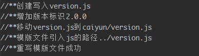

# compare-version-reload

安装
```
npm install compare-version-reload

// 升级
npm update compare-version-reload
```

使用

```js
var compareVersion = require("compare-version-reload");
compareVersion.init({
    filename: "version",
    path: "./",
    templateHtmlPath: "./src/index.html",
    templateLinkPath: "../",
    version: "2.0.0"
});
```

参数说明

```yaml
obj = { 
    filename, 
    path, 
    templateHtmlPath, 
    templateLinkPath,
    version 
};

参数：
    生成的js文件名，
    生成的js文件路径，
    需要处理的html文件及路径，
    html中引入生成js的相对路径，
    需要添加的版本
```

执行过程:  



原理: 

在入口文件中动态请求js文件，在js文件中调用全局的方法，这个方法去比对最新的版本号与html中的是否一致。

+ 1、为什么要这么做？  
因为html确实会被缓存！

+ 2、使用gulp，webpack都可以，因为原理不依赖打包工具。
如果版本不一致的做法是：在原链接上添加一个version参数并更新参数值。


作用

```yaml
/**
 * 版本控制 缓存
 * 注解：约定项目入口文件都会动态加载version.js文件
 * 在webpack里动态生成文件并移动到对应的打包目录
 * 文件内容是：版本号+回调函数
 *
 * 在项目入口文件中，用正则匹配替换版本号，通过在回调中比对版本号
 * 来判断当前html是否是缓存
 */
 ```
